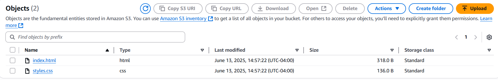

# AWS S3 Static Website Hosting

## What I Did
I hosted a static website on Amazon S3. This includes:

- Creating and configuring the S3 bucket
- Setting permissions for public access
- Uploading HTML and CSS files
- Enabling static website hosting

## Live Demo
🔗 [Link to Live Site](http://bucket-lacerda-github.s3-website.us-east-2.amazonaws.com)

## Live Preview

## Configuration Screenshots

| Bucket Overview | Static Hosting Settings |
|------------------|-------------------------|
|  |  |

| Bucket Policy | Files Uploaded |
|----------------|----------------|
|  |  |

## Skills Practiced
- S3 bucket management
- Website hosting with AWS
- IAM permissions for S3 access

- 🌐 [AWS S3 Website Hosting](https://github.com/Lacerdaa/s3-static-site) – Live static website hosted on Amazon S3

